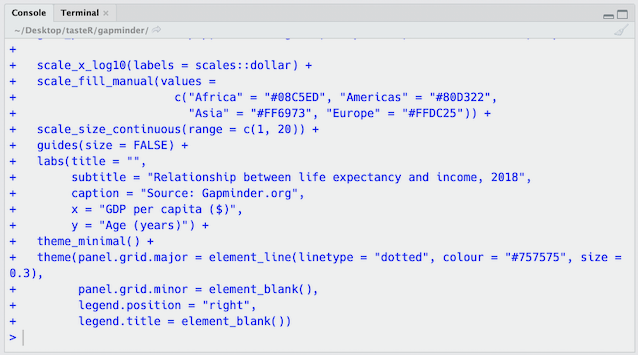

```{r setup, include=FALSE}
options(htmltools.dir.version = FALSE)
library(tidyverse)
```

class: inverse, middle, center
# R

---
## What is R?

R is an open source programming language for statistical analysis and data visualisation. It was developed by Ross Ihaka and Robert Gentleman of the University of Auckland and released in 1995. There are now over 16,000 [packages available for R](https://cran.r-project.org/web/packages) which provide functions for machine learning, genomics, time series forecasting, and interactive graphics amongst many others. 

R is widely used in academia and rapidly [replacing SPSS](https://datahowler.wordpress.com/2016/09/10/no-more-excuses-r-is-better-than-spss-for-psychology-undergrads-and-students-agree/) and other proprietary statistical software in undergraduate programmes. It is also used by well known companies like [Google](https://ai.google/research/pubs/pub37483), [Netflix](https://www.youtube.com/watch?v=dLKky1xIxtc) and [Airbnb](https://peerj.com/preprints/3182.pdf) for data analytics. Many graphics published by news outlets like the [Financial Times](https://johnburnmurdoch.github.io/slides/r-ggplot/#/) and the [BBC](https://medium.com/bbc-visual-and-data-journalism/how-the-bbc-visual-and-data-journalism-team-works-with-graphics-in-r-ed0b35693535) are  generated in R. The UK Government is also embracing R to help make their [statistical reporting](https://dataingovernment.blog.gov.uk/2017/11/27/transforming-the-process-of-producing-official-statistics/) workflow more efficient and [reproducible](https://dataingovernment.blog.gov.uk/2017/03/27/reproducible-analytical-pipeline/).

---
## Why use R?

- free
- open source
- advanced statistical analysis
- publication ready graphics
- increasingly used to support undergraduate teaching of statistics
- programming skills are attractive to employers

---
## Why use R?
Since R is a language it is also:

- open
- shareable
- reproducibile
- human readable
- [diffable](https://en.wiktionary.org/wiki/diffable)

and therefore supports the principles of open science.

---
class: inverse, middle, center
# RStudio

---
## RStudio's panes

```{r, echo=FALSE, fig.align='center'}
knitr::include_graphics("images/rstudio_panes.png")
```

---
## Console and source panes

.pull-left[

The **Console** pane is used to execute R commands immediately.
]

.pull-right[

The **Source** pane appears when you open a new file e.g. *File -> New File -> R Script*. Code can be saved in dedicated .R scripts and executed in the console with Ctrl-Enter/Cmd-Enter. Syntax highlighting and tab completion are also available.
]

---
## Environment and files panes

.pull-left[

The **Environment** pane shows the datasets, models, and plots that are loaded in the current R session. This pane also contains tabs with a scrollable history of executed code, connections to databases and Git options.
]

.pull-right[

The **Files** pane shows plots and interactive web content, help documentation, previous commands, and R packages that you can install and load.
]

---
## Customisation

The appearance of RStudio can be changed to suit you.

- Increase the font size: *Tools > Global Options > Appearance > Editor Font size*
- Move the Console pane to the right: *View > Panes > Console on Right*
- Add a margin column line: *Tools > Global Options > Code > Display > Show margin*
- Automatic text wrapping: *Tools > Global Options > Code > Editing > Soft-wrap R source files*

You can also change RStudio's overall theme. Opting for a dark theme reduces the amount of glare that your eyes are subject to. Change the global theme to Dark by selecting 'Appearance' in the *Global Options* menu and opt for an Editor theme with a dark palette such as 'Material'.

---
## Keyboard shortcuts

RStudio has many useful shortcuts that enable you to keep your hands on the keyboard thereby boosting your coding productivity. For example,

```{r, echo=FALSE}
tribble(
  ~Shortcut, ~Action,
  "Ctrl/Cmd + Enter", "Run your selected code in the Console",
  "Ctrl/Cmd + Shift + M", "Add piping operator",
  "Ctrl/Cmd + L", "Clear the console window",
  "Ctrl/Cmd + Shift + R", "Add a section break",
  "Shift + Ctrl/Cmd + 1", "Make the console full screen",
  "Ctrl/Cmd + Shift + A", "Format your code"
) %>% knitr::kable(format = "html")
```

For a complete list of all available shortcuts just type: `Alt + Shift + K`

---
class: inverse, middle, center
# R essentials

---
## Functions
A function is a block of reusable code that performs an action. Functions can be built-in or user-defined.

To see the underlying source code behind a function just run the function name.

```{r}
sqrt
```

Each function has one or more argument. Values are supplied to the arguments in parentheses behind the function name. For example, the function `sqrt()` takes one or more numeric values and returns the square root.

```{r}
sqrt(9)
```

---
## Objects
An object stores information like values, model coefficients, and plots in your R session.

Objects are created by assigning values to a name using the `<-` operator. 

```{r}
x <- 101
x
```

Object names cannot start with numbers or special characters (e.g. ? % ^) and R will overwrite an object if you assign new values to it.

You can remove an object from your R session using the `rm()` function.

```{r}
rm(x)
```

---
## Vectors
A vector is a simple one-dimensional structure that can contain only one type of value.

You can combine values into a vector using the `c()` function.

```{r}
x <- c(11, 19, 13, 16, 12, 12, 18, 14, 20, NA)
x
```

We can apply functions to that vector.

```{r}
mean(x, na.rm = TRUE)
```

You can extract a value from a vector by indexing its position.

```{r}
x[3]
```

---
## Data types

.pull-left[
R supports a number of data types including: 

- **integer**: whole numbers 
- **double**: decimal numbers
- **character**: strings
- **logical**: Boolean values
]

.pull-right[
```{r}
typeof(5L)
typeof(5.5)
typeof("spaghetti")
typeof(TRUE)
```
]

---
## Lists
Lists can store vectors of different lengths with different data types.

```{r}
x <- list(1:10, c("Good", "Bad", "Ugly"), TRUE)
str(x)
```

Names can be assigned to each element in a list to aid subsetting.
```{r}
x <- list(numbers = 1:10, strings = c("Good", "Bad", "Ugly"), boolean = TRUE)
x$strings
```

---
## Data frames
Data frames store multiple vectors of the same length with different data types.

```{r}
film <- c("A Fistful of Dollars", "For a Few Dollars More", "The Good, The Bad and The Ugly")
year <- c(1964, 1965, 1966)
budget <- c(200000, 600000, 1200000)
data.frame(film, year, budget)
```

---
## Packages
Packages are collections of R functions and data. There are [over 16,000 user-contributed packages](https://cran.r-project.org/web/packages) available to install from CRAN. 

Just type `install.packages()` in the console with the name of the package in inverted commas:

```{r, eval=FALSE}
install.packages("tidyverse")
```

Once installed you can load the package using the `library()` function like this:

```{r, eval=FALSE}
library(tidyverse)
```

---
## Finding help
You can find help within R using the `?` function. For example, if you want to learn more about a function just place a ? before the function name. 

For example, if you wanted to read up on the `sqrt()` function you'd enter:

```{r, eval=FALSE}
?sqrt
```

You can also use the `help()` function:

```{r, eval=FALSE}
help(sqrt)
```